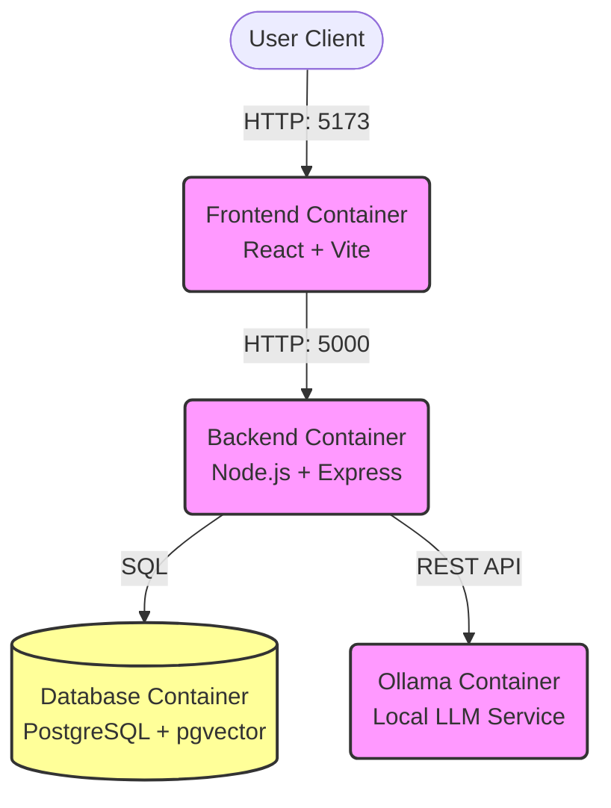

# Engwah Leasing Portal (ew-leasing-app)

**Version:** 3.0 (Security & Intelligence Update)
**Status:** Production-Ready

## Overview

The **Engwah Leasing Portal** is an enterprise-grade Property Management System that serves as an intelligent business assistant. It features **Eva 3.0**, a "Senior Commercial Leasing Analyst" AI, capable of understanding complex technical specifications and enforcing strict security protocols.

## Key Features

*   **Centralized Truth & Document Intelligence**: A single source of truth for all Malls, Units, Tenants, and Contracts. Integrates uploaded Sales Kits and Floor Plans.
*   **Expert AI Analysis (Eva)**: Context-augmented AI providing detailed technical breakdowns in rich-text format.
*   **Enhanced Security & Governance**: Role-Based Access Control (Sudo, Admin, Staff, Agent), rate limiting for AI (50 req/hr), and chat audit logs.
*   **Zero-Maintenance Infrastructure**: Built on Docker containerization with secure networking via Tailscale.

## Technology Stack

*   **Frontend**: React.js (Vite) + Tailwind CSS + Markdown Rendering
*   **Backend**: Node.js (Express) REST API + Event-Driven Architecture
*   **Database**: PostgreSQL (pgvector)
*   **AI Engine**: Hybrid support for Ollama (Local) or OpenAI/Cloud APIs
*   **Infrastructure**: Docker Compose + Tailscale

## Architecture Diagram

## Getting Started

### Accessing the System
*   **Local**: `http://localhost:5173`
*   **Remote**: Use the provided Tailscale secure link.

### Logging In
1. Enter assigned **Username** and **Password**.
2. **Super Admin (Sudo)**: `sudo` / `password` (For critical system changes)
3. **Default Admin**: `admin` / `admin` (Change immediately)

## User Roles

*   **Sudo (Super Admin)**: Full system control, Database mutations, Emergency access.
*   **Admin**: User management, Property management.
*   **Staff**: Operational access (Edit units, Upload docs).
*   **Agent**: Read-only access to availability and specs.

## Documentation

For a comprehensive guide, including the technical architecture analysis and a detailed user guide, please refer to the [PROPOSAL_AND_GUIDE.md](PROPOSAL_AND_GUIDE.md).
