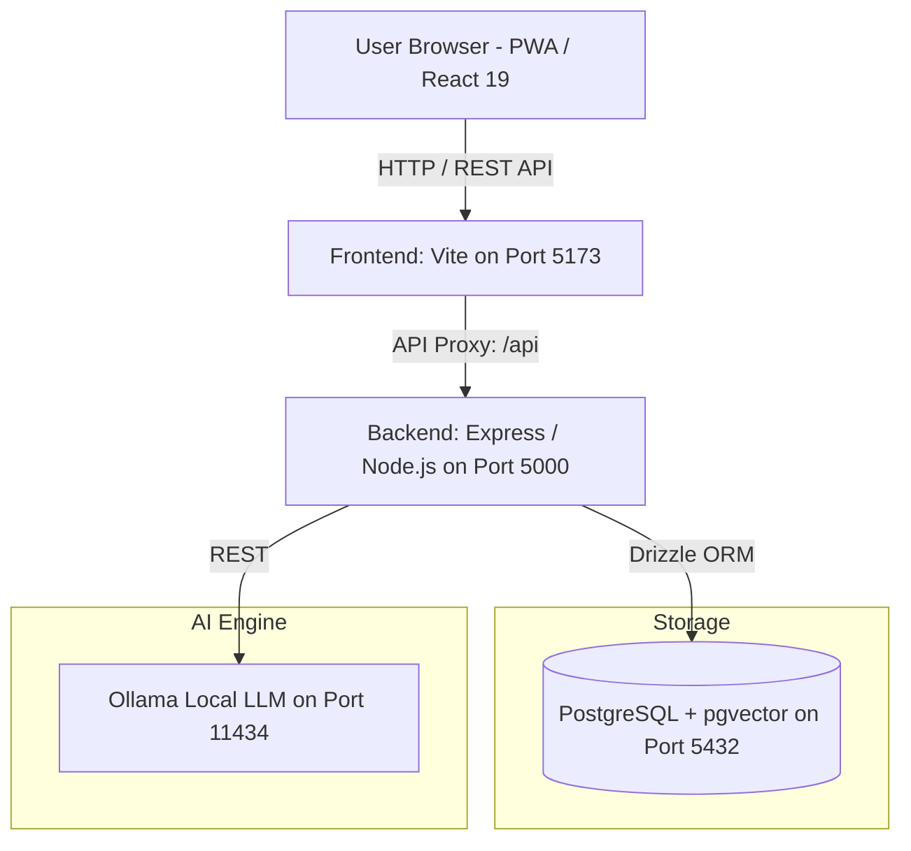
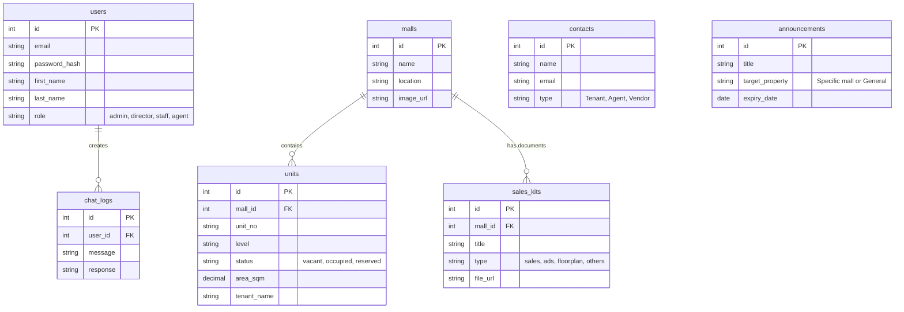
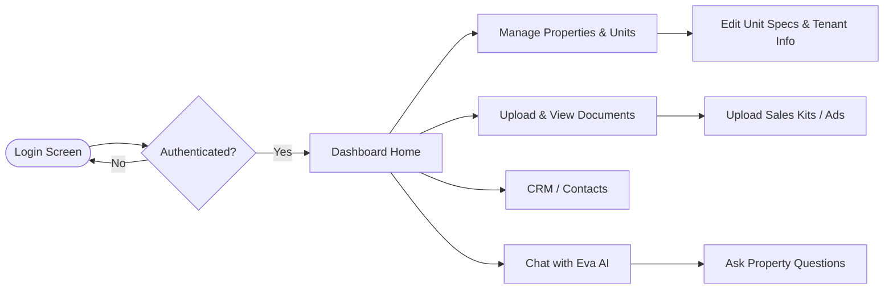

# 🏢 Engwah Leasing Portal

> A modern, enterprise-grade Property Management System for commercial real estate and shopping malls — with a built-in AI analyst, **Eva**.


## 📋 Overview
The Engwah Leasing Portal is a containerized, full-stack application designed to streamline the management of retail properties, units, tenants, and commercial documents. It features a unique, context-aware AI assistant (Eva) that interfaces directly with the live database to provide insights.

[Insert Screenshot: Main Dashboard view showing property metrics and occupancy charts]

## 🏗️ Visual Architecture & Flows

### System Architecture


### Database Schema (ERD)


### User Journey Flow


## ✨ Key Features

*   **🏢 Property & Unit Management**: Manage mall portfolios with photo uploads. Granular tracking of level orders and units (status, area, tenant details, M&E specs).

    [Insert Screenshot: Property Management view listing malls and units]

*   **🤖 AI Leasing Analyst (Eva)**: Powered by a local Ollama LLM (`qwen2.5:1.5b`), Eva reads live database context to answer complex property queries.

    [Insert Screenshot: Eva AI Chat interface showing an example query about property availability]

*   **📁 Document Repository**: Upload and categorize Sales Kits, Ads, Floor Plans, and Legal Documents securely. Linked directly to specific malls.

    [Insert Screenshot: Document Repository showing categorized uploaded files]

*   **👥 Contacts CRM**: Directory of Tenants, Agents, and Vendors accessible to authorized roles.
*   **🔔 Announcements System**: Broadcast system-wide or property-specific notifications with optional expiry dates.
*   **🔐 Role-Based Access Control (RBAC)**: Secure JWT authentication with `admin`, `director`, `staff`, and `agent` roles.

### Planned / WIP Features
*   *Inventory Tracker* (Planned)
*   *Team Chat* (Planned)
*   *Cloud File Hub* (Planned)
*   *Advanced Analytics / Revenue Forecasts* (Planned)

## 🧰 Tech Stack

*   **Frontend**: React 19, Vite (Rolldown), Tailwind CSS 4, Lucide React, Recharts
*   **Backend**: Node.js, Express, TypeScript, Drizzle ORM
*   **Database**: PostgreSQL 16 + `pgvector` extension
*   **AI Engine**: Ollama (Local LLM - `qwen2.5:1.5b`)
*   **Infrastructure**: Docker, Docker Compose

## 🚀 Getting Started

### Prerequisites
*   [Docker](https://docs.docker.com/get-docker/) (v24+)
*   [Docker Compose](https://docs.docker.com/compose/install/) (v2+)

### Installation & Run

1.  **Clone the repository:**
    ```bash
    git clone <repository-url>
    cd <project-folder>
    ```

2.  **Environment Setup:**
    ```bash
    cp backend/.env.example backend/.env
    ```
    Configure the variables in `backend/.env` (especially `JWT_SECRET` and `DB_PASSWORD`).

3.  **Start Services via Docker Compose:**
    ```bash
    docker-compose up --build
    ```
    This spins up the Database (`pgvector`), Backend (`API`), Frontend (`React`), and the Local LLM (`Ollama`).

4.  **Access the Portal:**
    Open `http://localhost:5173` in your browser. On the first launch, you will be prompted to create your initial Admin account.

## 📂 Project Structure

```
.
├── backend/            # Express Node.js API
│   ├── src/            # Core logic (DB, schema)
│   ├── .workspace/     # AI personas & SOPs
│   ├── uploads/        # System storage (images, docs)
│   ├── server.ts       # API & App entrypoint
│   └── package.json
├── frontend/           # React + Vite application
│   ├── src/            # React components (Dashboard, App.jsx, etc.)
│   ├── public/         # Static assets
│   ├── vite.config.js  # Vite settings
│   └── package.json
├── docker-compose.yml  # Local Docker configuration
├── init.sql            # Postgres database initialization script
└── schema.md           # Database documentation details
```
